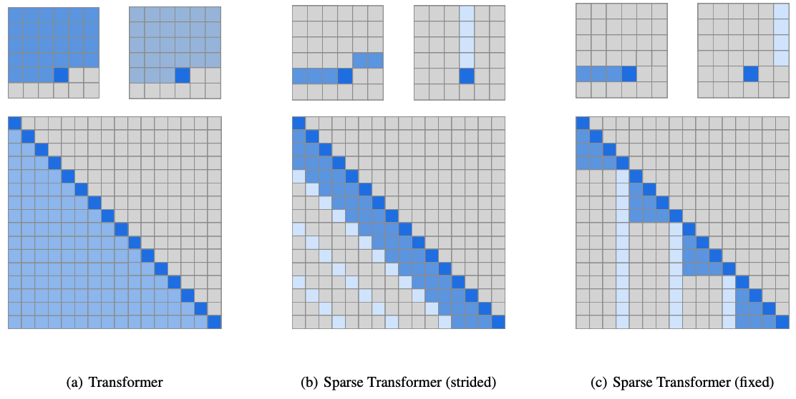
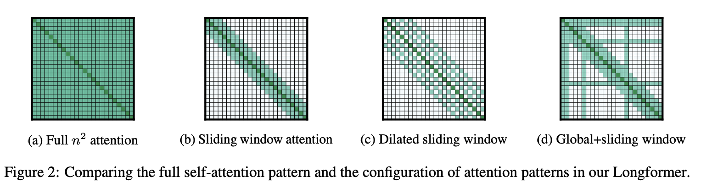
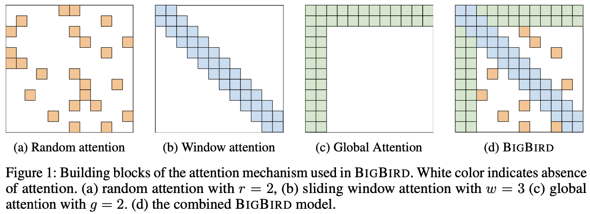
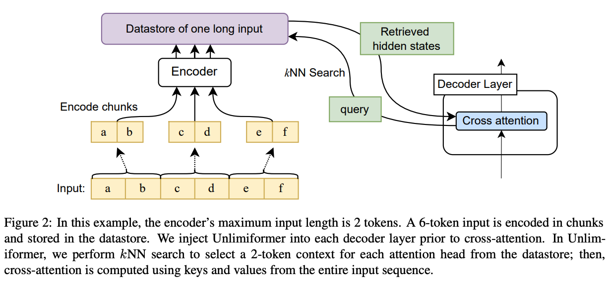

# 
 Modelling Long Sequence with a large Context

## Task

**Design and implement a model that can handle long sequences and large contexts while
keeping within the limits of GPU memory.**

## Attention Mechanism
$$y=\textup{softmax}(\frac{QK^T}{\sqrt{d_S}})*V$$
* **The computational complexity of self-attention is $O(n^2)$ if has $n$ tokens.**
* **Attention can model dependencies between each tokens regardless of their relative position, which realize a global receptive field to capture long-range correlations.**
* **If increase the tokens numbers to 32768 from 4096, the complexity of attention will indeed increase significantly by a factor of 64.**
* **Thus, the key to reducing computational complexity of attention is to <u>sparsify the attention calculation</u> while maintaining as close as possible to the overall Receptive field.**

## Solutions
### Sparse Transformer (Open AI, 2019)

* **Computational complexity: $O(n\times \sqrt{n})$**
* **Arxiv: https://arxiv.org/pdf/1904.10509.pdf**

### Longformer (AI2, 2020)

* **Computational complexity: $O(n)$**
* **Arxiv: https://arxiv.org/pdf/2004.05150.pdf**

### Big Bird (Google AI, 2020)

* **Computational complexity: $O(n)$**
* **Arxiv: https://arxiv.org/pdf/2007.14062.pdf**

### Unlimiformer (CMU, May 2023)

* **Computational complexity: $O(n)$**
* **Arxiv: https://arxiv.org/pdf/2305.01625.pdf**